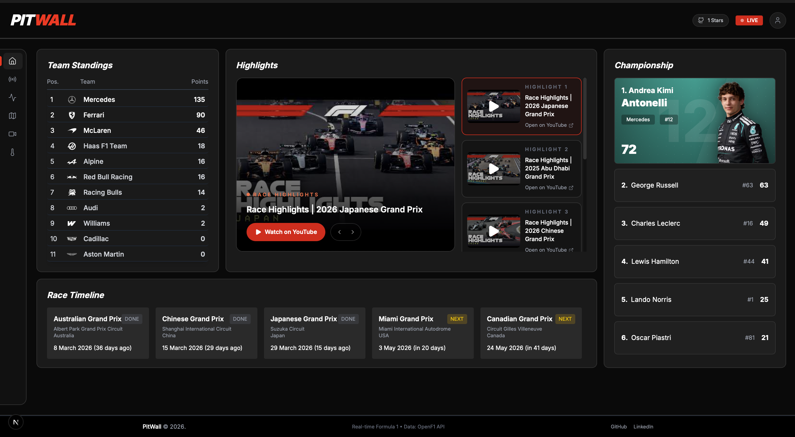

<!--Project Video Link -

<h4 align="center">There are many features that are not inlcuded in this video. To enjoy the functionality clone this repo and just play with it.</h4> -->

<!-- <h4>Live Project Link - https://.../</h4> -->

<!-- <br/>
<br/> -->

<!-- -----------------------  Header  ----------------------------- -->
<h1 align="center">PitWall</h1>

<p align="center">

  
  
  

  

  

  

  

  

  
</p>

<h4 align="center"> 
	🚧  Service Sphere 🚀 Under construction...  🚧
</h4>



<hr>

<!-- ======================= Navigation ======================= -->

<p align="center">
<a href="#project-overview">Project Overview</a> |
<a href="#features">Features</a> |
<a href="#technologies">Technologies</a> |
<a href="#requirements">Requirements</a> |
<a href="#starting">Getting Started</a> |
<a href="#license">License</a> |
<a href="https://github.com/PrabhakaranVijay">Author</a>
</p>

<br>

<!-- ======================= Project Overview ======================= -->

## 🎯 Project Overview

**PitWall** is a production-grade, real-time Formula 1 analytics dashboard built for data-driven motorsport enthusiasts. It streams live telemetry, race positions, and session data directly from the [OpenF1 API](https://openf1.org) into a sleek, performant React web application.

---

<!-- ======================= Features ======================= -->

## ✨ Features

- **Live Leaderboard**: Real-time position tracking and gap times.
- **Car Telemetry**: Live speed, throttle/brake, and gear visualization charts.
- **Race Strategy**: Tyre stint tracking and visual timeline.
- **Race Control**: Log of real-time race events, flags, and penalties.
- **Weather Station**: Track conditions, temperatures, and wind metrics.

---

<!-- ======================= Technologies ======================= -->

## 🚀 Technologies

- **Frontend**: Next.js 15 (App Router), React, Tailwind CSS V4, Recharts, Lucide React
- **Backend**: Python, FastAPI, Uvicorn, WebSockets (for live streaming)
- **Data Layer**: Redis (Pub/Sub & Caching), PostgreSQL (Async Data Storage)
- **Infrastructure**: Docker Compose

---

<!-- ======================= Getting Started ======================= -->

## 🚩 Getting Started

### Prerequisites

- Docker and Docker Compose
- Node.js > 20 (if running frontend locally outside docker)
- Python > 3.12 (if running backend locally outside docker)

### Running with Docker (Recommended)

The easiest way to boot the entire stack is with Docker Compose. This spins up the Postgres Database, Redis cache, Python Backend, and Next.js Frontend.

```bash
cd pitwall-dashboard
docker compose up --build -d
```

- **Frontend App**: `http://localhost:3000`
- **Backend API**: `http://localhost:8000`
- **Swagger Docs**: `http://localhost:8000/docs`

### Development Setup (Local)

If you wish to run the services bare-metal for development:

**1. Infrastructure**
Start Redis and Postgres via Docker:

```bash
docker compose up db redis -d
```

**2. Backend**

```bash
cd backend
python -m venv venv
source venv/bin/activate
pip install -r requirements.txt
uvicorn app.main:app --reload --port 8000
```

**3. Frontend**

```bash
cd frontend
npm install
npm run dev
```

## Architecture Overview

1. **Ingestion Loop** (`worker/ingestion.py`): A continuous async loop queries OpenF1 safely without hitting rate limits.
2. **Redis Streams**: Incoming data is pushed rapidly to Redis Pub/Sub channels (e.g., `live_positions_channel`).
3. **WebSocket Hub** (`websocket/stream.py`): The FastAPI server bridges Redis events directly to connected web clients via WebSockets.
4. **React Dashboard**: The Next.js client consumes WebSockets utilizing custom hooks (`useWebSocket`) to re-render charts at 60fps immediately as data arrives.

## Contributing

Pull requests are welcome. Please adhere to the established `.eslintrc` conventions and use feature branches.

---

## 🔐 Environment Variables

Some security keys and API credentials are not included in the repository.
If you want to run the full project, please contact me and I will provide the required configuration.

---

## 📄 License

This project is under license from MIT. For more details, see the [LICENSE](LICENSE.md) file.

Made with ❤️ by <a href="https://github.com/PrabhakaranVijay" target="_blank">Team PitWall</a>

&#xa0;

---

## ⭐ If You Like This Project

Give it a ⭐ on GitHub and feel free to fork or improve it!

<br/>
<br/>
<a href="#top" align="center">Back to top</a>
